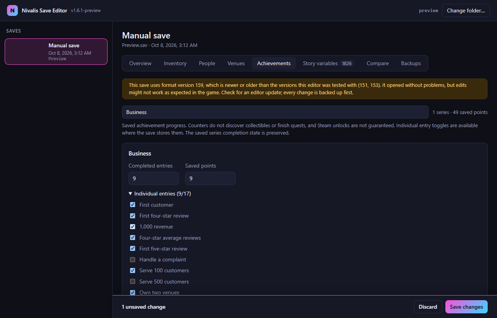
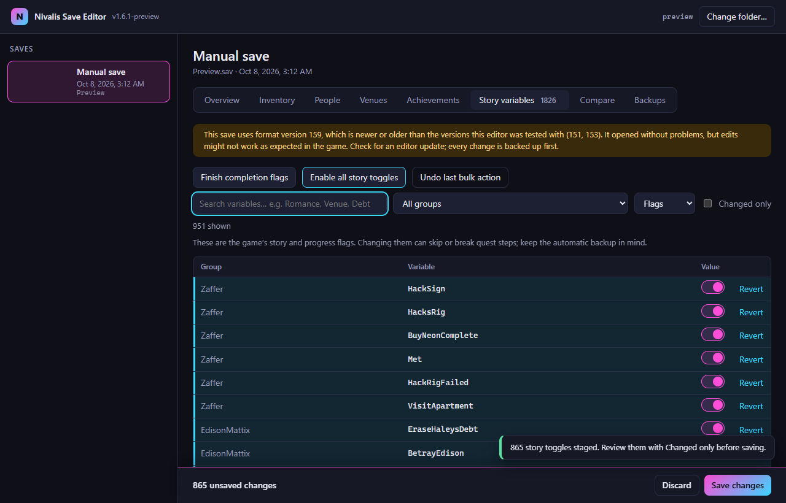

# Nivalis Save Editor

A small desktop editor for **Nivalis Nights** save files (`.sav`), built with Tauri.

- Browse your saves with their screenshots, location, in-game day and playtime
- Edit **money**
- **Skills**: set the level of each skill you have started (Barter, Boat, Cooking, Farming, Fishing, Serving, Managing)
- Browse, search and edit the game's **1,800+ story variables** (flags and numbers: relationships, venue levels, quest steps, …)
- **Story bulk actions**: finish explicit completion flags, or enable every boolean story toggle, with a change preview and undo before saving. The broad action includes failure flags and conflicting choices; neither action runs quests or guarantees a finished story.
- **Achievements**: browse and search 11 named achievement series, edit saved counters and points, and toggle the 17 individually stored business entries. Edits use the normal verified save and backup workflow, update total saved points and appear in comparisons. Steam unlocks and in-game completion have not been verified.
- **Inventory**: view and edit the items in your inventory, your venues' storage, fridges and furniture, and vendor stock; add any of 1,300+ items, change quantities and freshness
- **Compare** two saves to see which variables a quest step changed, and copy values across
- **People** and **Venues**: friendly editors for relationship levels and for venue level, customers served and review stars; debt on the overview
- **Backups**: up to 10 gzip-compressed backups per save (Windows: `%LOCALAPPDATA%\Nivalis Save Editor\Backups`, Linux: `~/.local/share/nivalis-save-editor/backups`; outside Steam Cloud), the first one kept permanently, with a per-backup comparison and one-click, undoable restore. Every edit is verified by re-reading the result before it is written

Saves live in `%USERPROFILE%\AppData\LocalLow\ION LANDS\Nivalis Nights\` on Windows, and in the Proton prefix on Linux: `~/.local/share/Steam/steamapps/compatdata/1488490/pfx/drive_c/users/steamuser/AppData/LocalLow/ION LANDS/Nivalis Nights` (the editor also looks in `~/.steam/steam`, Flatpak Steam and the extra Steam libraries listed in `libraryfolders.vdf`). **Manual saves can be edited while the game is running**: save in the game, edit that save, then load it again. The autosave can only be changed once the game is closed, because the game keeps overwriting it; the editor checks for the running game on both platforms. Steam Cloud syncs this folder, so the edited file becomes the synced version.

Tested with save versions **151** and **153** (the game patch of 1 October 2026). Saves of any other version still open if their layout checks out, with a warning in the save view and again before writing; a save whose layout the editor doesn't understand is refused, whatever its version.

## Screenshots

| | |
|---|---|
|  |  |
|  |  |
|  | |
|  |  |

## Development

Requirements: Node 20+, Rust (stable). On Windows: MSVC toolchain, Visual Studio C++ build tools, WebView2 (built into Windows 10/11). On Linux: WebKitGTK dev packages (e.g. `libwebkit2gtk-4.1-dev`, `libappindicator3-dev`, `librsvg2-dev`).

```sh
npm install
npm test              # parser tests against the sample saves in the parent folder (or NN_SAVE_DIR)
npm run app:dev       # run the app with hot reload
npm run app:portable  # release binary: src-tauri/target/release/nivalis-save-editor(.exe)
npm run app:build     # Windows: NSIS installer; Linux: AppImage
npm run release       # tests + Windows: portable zip; Linux: AppImage
```

The Linux release repacks the AppImage with [appimagetool](https://github.com/AppImage/appimagetool/releases) to add AppStream metadata, the license and the README. Set it up once in `tools/` (git-ignored):

```sh
chmod +x appimagetool-x86_64.AppImage
./appimagetool-x86_64.AppImage --appimage-extract
mkdir -p tools && mv squashfs-root tools/appimagetool
```

CLI for inspection and scripted edits:

```sh
npm run cli -- info  <save.sav>
npm run cli -- vars  <save.sav> [filter]
npm run cli -- diff  <old.sav> <new.sav>
npm run cli -- check <save.sav>...
npm run cli -- skills <save.sav>
npm run cli -- achievements <save.sav>
npm run cli -- venues <save.sav>
npm run cli -- edit  <save.sav> --money 2500.00 --set GameState.Debt=0 --skill Boat=3 -o out.sav
npm run cli -- edit  <save.sav> --venue Venue_NoodleBar.level=5 --venue Venue_NoodleBar.served=600 --venue Venue_NoodleBar.stars=5 -o out.sav
npm run cli -- edit  <save.sav> --finish-story-flags -o out.sav
# Advanced: enables every boolean, including failures and conflicting choices
npm run cli -- edit  <save.sav> --enable-story-toggles -o out.sav
```

## Layout

| Path | Contents |
|---|---|
| `core/` | Save-format parser and editor. Pure JS, no framework imports; runs in Node and in the webview |
| `cli/` | Node command-line tool built on `core/` |
| `test/` | `node:test` suite; round-trips and edits every sample save |
| `src/` | Web UI (vanilla JS + Vite) |
| `src-tauri/` | Rust shell: locate saves, read files, backup + atomic write, game-running check |

## Save format notes (versions 151 and 153)

Reverse-engineered; the game is an IL2CPP Unity build with a custom `BinaryWriter`-style serializer. Little-endian; strings are 7-bit-length-prefixed UTF-8. No compression, encryption or checksum found.

Version 153 has the same layout as 151. A 151 save loaded and re-saved by the patched game keeps its sections and inventory grammar; the story variables gain `Chess.NextTryDay` and five `GlobalInventory*` counters and lose `Venue_NoodleBar.HasAllIngredients`.

**Header**

| Offset | Type | Meaning |
|---|---|---|
| 0 | int32 | Save version (151 or 153) |
| 4 | int32 | Scene/area index (e.g. 2 = Meridian Market) |
| 8 | float | Playtime in seconds |
| 12 | int32 | Unix timestamp of the save |
| 16 | int32 | In-game clock in seconds (day = value / 86400) |
| 20 | int32 | Money in **cents** (155880 = 1558.80 credits) |
| 24 | int32 + strings | GUID list, followed by more header data up to the string `END_HEADER` |

**Manager sections.** Around 30 sections, each introduced by an uppercase GUID string, without a length prefix. Class names from the game metadata include `PlayerManagerSave`, `InventoriesSave`, `EconomyManagerSave`, `ArticyGlobalVariablesSave`, `SkillLevelsControllerSave`, `TimeOfDayManagerSave`.

**Story variables (articy:draft globals).** Stored **twice**, and the copies must stay identical:

| Section key | int | bool | string |
|---|---|---|---|
| `BD57C1E7-3EAE-4896-A466-73822A382AE4` | 1 | 3 | 4 |
| `53BD367F-1E7D-4886-91D8-D8988CDF96EC` | 3 | 2 | 4 |

Layout: `int32 count`, then for each entry `string name, int32 type, value`. Ints are int32, bools are 1 byte, strings are length-prefixed.

**Ghost blocks (world entities).** `string "Ghost_<guid>"`, `int32 absolute end offset`, payload, `string "Ghost_<guid>"` (closing tag). There are more than 13,000 of them and they are not nested. Any edit that changes the file size must rewrite every end offset after the edit point, which is why the editor currently only makes same-size edits.

**Money.** Stored twice: in the header (offset 20) and as an int32 immediately after the player's Ghost block, which follows the string `Guid_PLAYER_MANAGER_SAVE`.

**In-game time.** The clock value is also stamped into hundreds of world records, so the editor keeps it read-only.

**Inventories** (section key `2605882F-31F5-4D75-9F72-802B33601A6B`). The section holds an `int32` container count, then the containers: the player's (`PLAYER_INVENTORY`), three per venue (`<venue>_NormalInventory`, `_RefridgeratedInventory`, `_FurnitureInventory`) and one per vendor (keyed by the vendor's GUID).

| Part | Layout |
|---|---|
| Container | `string key, byte flagA (1 = vendor), byte flagB, int32 itemCount, items, 12-byte trailer (byte hasCapacity, int32 capacity, …)` |
| Item | `string itemGuid, int32 stackCount, stacks` |
| Stack | `int32 price paid (cents), int32 day acquired, int32 quantity, int32 freshness` |

Freshness is counted in 8-hour units and drops at 00:00, 08:00 and 16:00; 0 means the item doesn't spoil. Inventory edits change the file size, so the editor re-encodes the section and shifts every later Ghost block end offset.

**Skills** (section key `2F00F72D-896A-42F8-92C4-E775FB79970E`). `int32 count`, then per skill `string skillGuid, float xp, int32 level`. A skill gets an entry once the player has gained XP in it. XP is cumulative; each skill definition in the game assets lists the XP every level costs (Boat: 2000, 5000, 10000, …, so level 2 starts at 7000), and the stored level always matches the XP. Stored levels start at 0, while the game shows them starting at 1; the editor and the CLI use the game's numbering. The game has been seen to store `NaN` as the XP of a skill at its top level.

**Achievements** (`03H1F65F-148C-9E66-GHQE-4109P1286Q17`). Structural round-trips and edits verified against two local version **159** saves; the existing untested-version warning remains because no in-game loading was tested. Layout: `int32 totalPoints, int32 seriesCount`, then per series `string guid, int32 completedEntriesCount, int32 points, byte isCompleted, int32 singularEntryCount, byte[] singularEntriesSave`. Field names were checked in the installed game's IL2CPP metadata; series names and business entry ordering were checked against its asset definitions. The earlier `55F0A877-…` section contains GUID/boolean records and is left untouched. Counter edits retain the saved series completion byte. No records are inserted or resized; missing sections show an unavailable message, malformed sections refuse editing. Total points change by the delta in edited series points.

**Bulk story actions.** “Finish completion flags” selects boolean names ending in Complete, Completed, Finished or Done (optionally followed by digits). “Enable all story toggles” selects all booleans. Both operate across all groups regardless of the current search filters, stage edits to both variable tables, preserve numbers/text, and require the normal backed-up save action. Undo restores the prior staged values while preserving subsequent manual changes. There is no universal quest-completion recipe: quest steps, relationships, world entities and mutually exclusive outcomes cannot be inferred from toggles alone.

**Venues** (`VenueAreaGhost`, one Ghost block per venue). The level, customers served and reviews live here; the `Venue_<name>.Level`, `.CustomersServed`, `.ReviewScore` and `.ReviewAmount` story variables are copies the game rewrites from this record when a save loads (it only does so for some venues, so the copies of NPC-run venues can be stale). Editing only the variables therefore has no effect in the game. The record is the block that contains the venue's GUID and has this shape:

| Part | Layout |
|---|---|
| Start | `string tag, int32 end offset, int32, string ghostGuid, 3 bytes, string ghostGuid, int32, byte, 7 floats (position, rotation), byte, float` |
| Then | `int32 n` + n GUID strings (placed furniture), `int32 n` + n GUID strings (trash), `int32 initial trash count` |
| Stats | `int32 currentLevel, int32 mealsServed (customers served), int32 totalVisits`, then more venue state |
| Reviews | later in the block: `int32 count`, then per review `string venueGuid, int32 stars, string mainItem, 5 floats (cleanliness, rain, snow, comfort, service), int32 time, string personGuid, int32 n` + n delivered meals (`string item, int32 price, 2 floats, string mealGhost`), `byte, string override text, byte, int32, int32, int32 n` + n `(string, int32)` |

The review score the game shows is an average over the reviews (weighted by age) and the review count is the number of records, so the editor changes the score by setting every review's stars and leaves the count alone. The game has level-up and level-down checks against customers served and the average review. Levels above 5 have not been seen.

**Item names.** Item GUIDs are the ids of item definitions in the game's asset files. `scripts/build-item-catalog.mjs` extracts names, base prices, freshness and refrigeration flags, plus vendor and venue names and the skill level tables, into `src/data/items.json`:

```sh
node scripts/build-item-catalog.mjs "C:/Program Files (x86)/Steam/steamapps/common/Nivalis Nights"
```

Re-run it after every game update. Updates renumber the script ids the item, dish and vendor definitions are recognised by; the script finds the new ids through the GUIDs already in `items.json` and stops without writing if it cannot read the definitions.

**Not decoded yet.** Text variable edits (size-changing, like inventories) and the player position (floats at the end of the file).

## AI transparency

This project was built with the help of Claude Opus 5.5 (Anthropic) as a coding assistant. Claude did most of the save-format reverse engineering and wrote most of the code under RenokK's direction. RenokK set the goals, tested the editor in-game with real saves, and approves each release. The test suite (`npm test`) runs every kind of edit against real save files.

The app itself contains no AI features and makes no network requests; it only reads and writes local save files.

## License

Copyright (c) 2026 RenokK. Licensed under [CC BY-NC 4.0](LICENSE.txt). You may share and modify it for noncommercial purposes with attribution; commercial use, including reselling or bundling it into commercial products, is not permitted.
